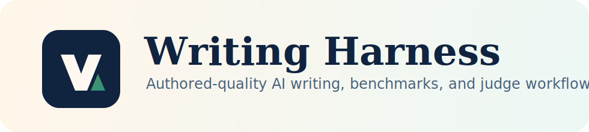
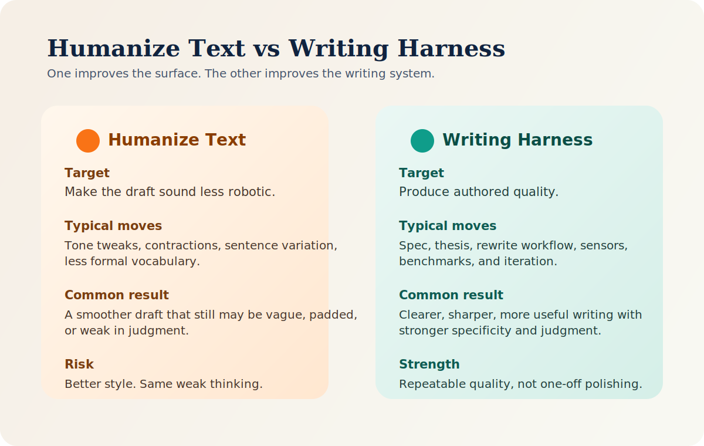
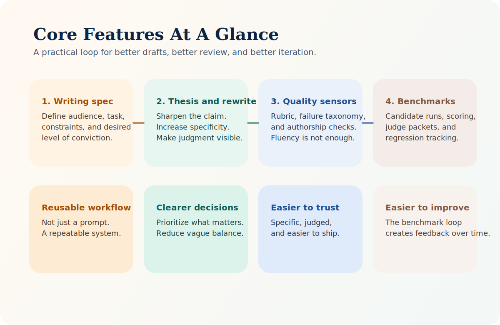
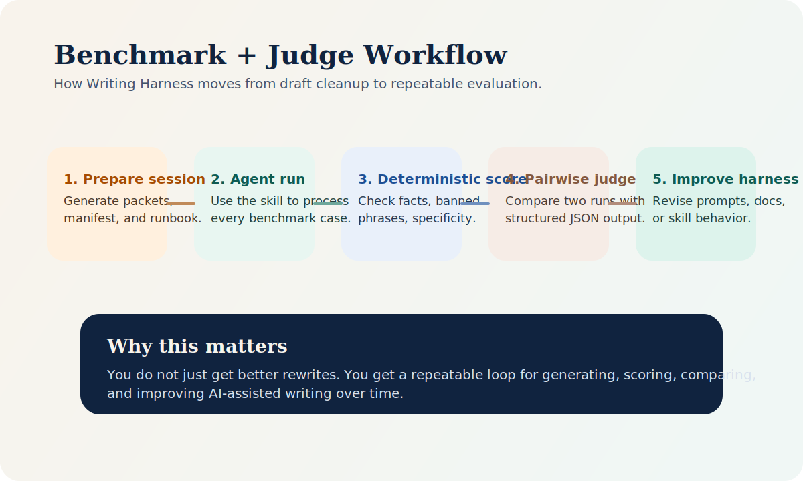

# Writing Harness



Build authored-quality AI writing with a reusable skill, a benchmark loop, and agent-native judge workflows.

Open-source tooling for turning AI drafts into writing that is clearer, sharper, more useful, easier to trust, and more process-auditable.



Most "humanize AI text" advice aims too low. It focuses on surface cleanup. Writing Harness treats writing quality as a system problem instead.

> Better AI writing does not come from sounding more human. It comes from building a better harness.


**Use Cases:** rewrite AI drafts • compare prompt variants • benchmark writing quality • evaluate agent output • ship more trustworthy copy faster

## Why teams use it

- Upgrade AI drafts beyond tone tweaks and cosmetic rewrites.
- Give agents a real writing workflow instead of a vague "sound more human" instruction.
- Add sensors, benchmarks, and judge loops so quality improves over time.
- Make writing quality more repeatable across prompts, agents, and contributors.

## What you get

- A reusable `writing-harness` skill for authored-quality rewrites.
- A `writing-lint` layer for catching stock AI phrasing, weak openings, weak endings, and missing claims.
- A cognitive-writing layer for baseline reports, AEH architecture, module specs, and rollback-aware QA.
- A deterministic benchmark suite for regression testing.
- An agent-native judge workflow for pairwise comparisons and trace-aware QA.
- A repository structure that separates guides, sensors, and evaluation artifacts.

## Core Features



Why this feels practical:

- It gives you a reusable rewrite workflow, not just a better prompt.
- It gives you evaluation artifacts, not just taste-based opinions.
- It gives you benchmark and judge loops, so quality can improve over time.

## Benchmark + Judge Workflow



## Before / After

### Technical explainer

**Before**

> It is important to note that retries can improve reliability in modern systems. In today's fast-paced digital environment, organizations should implement retries to ensure robust performance and a seamless user experience.

**After**

> Retries help reliability only when you use them selectively. Retry timeouts and `429` responses with backoff; do not blindly retry every failure.

### Founder update

**Before**

> We had a productive week and learned a lot from customer conversations. Users are excited about the product direction, and we see strong opportunities to improve the onboarding experience and pricing communication.

**After**

> Customer conversations this week clarified one issue faster than any dashboard could: the product is landing, but the pricing story is not.

These are compact examples from the benchmark set. The shift is the point: less generic optimism, more specific observation and judgment.

## Featured Example

The harness is not only for short rewrites.

It can also structure longer analytical writing with:

- a defined reader
- a cognitive target
- an explicit argument
- a process-aware editorial loop

See the worked English example:

- [`docs/examples/cs249r-book-article.md`](/Users/f/GitHub/writing-harness/docs/examples/cs249r-book-article.md)

This example uses the open-source project [`harvard-edge/cs249r_book`](https://github.com/harvard-edge/cs249r_book) as the subject and shows how the harness can move a reader from:

> "This is a strong textbook repo."

to:

> "This is a deliberately engineered curriculum system."

## Quick Start

Run the deterministic checks:

```bash
python3 scripts/run_writing_lint.py --dir runs/codex-sample-v1
python3 scripts/run_writing_lint.py --cw-json runs/codex-sample-v1
python3 scripts/run_writing_harness_evals.py
python3 scripts/run_writing_harness_benchmarks.py --sanity
```

Prepare a one-session benchmark run for an agent:

```bash
python3 scripts/prepare_agent_native_session.py benchmark --outdir runs/prompt-a
python3 scripts/check_agent_native_run_status.py --manifest runs/prompt-a/run-manifest.json
python3 scripts/run_writing_harness_benchmarks.py --candidate-dir runs/prompt-a/results
```

If you want to study a full repository-analysis article rather than a compact rewrite, start with the featured example above, then inspect the benchmark and judge layers.

## Agent = Model + Writing Harness

The model is only one part of the system.

If you ask a model to "write better," you usually get fluent averages: plausible language, weak judgment, and generic structure.

If you want stronger writing, you need a harness around the model.

In this project, the harness has two jobs:

1. Guide the writing process.
2. Sense whether the result is actually good.

In the upgraded cognitive-writing model, that process is explicit:

1. baseline
2. architecture
3. module spec
4. draft
5. unit test
6. integration and rollback

That means this repository is not just a set of prompts. It is a control system for authored text.

## What This Repository Contains

This repository has four main parts:

1. `README.md`
   The guide and operating philosophy.
2. [`skills/writing-harness/SKILL.md`](/Users/f/GitHub/writing-harness/skills/writing-harness/SKILL.md)
   The reusable agent skill.
3. [`skills/writing-harness/references/`](/Users/f/GitHub/writing-harness/skills/writing-harness/references/)
   The durable system of record for workflows, sensors, cognitive baselines, architecture, and rollback rules.
4. [`evals/`](/Users/f/GitHub/writing-harness/evals/)
   Deterministic checks, benchmarks, judge workflows, and reports.

Examples and worked articles live under [`docs/examples/`](/Users/f/GitHub/writing-harness/docs/examples/).

This follows a harness-first documentation rule:

> The entrypoint should be short enough to steer the agent.
> The system of record should be structured enough to teach the agent what to do next.

## Why "Sound More Human" Is Too Weak

"Sound more human" is a style objective. It is not a quality objective.

It often pushes people toward cosmetic edits:

- add contractions
- loosen the tone
- vary sentence length
- swap formal words for friendlier ones

Those can reduce obvious AI markers, but they do not reliably improve the writing itself.

Some human writing is vague, padded, and forgettable. Some excellent writing is formal, technical, and tightly controlled. So the real target cannot be "human-like" alone.

The better target is:

- human-level authorship
- or better-than-average human writing quality

This project therefore optimizes for:

- authored, not assembled
- situated, not generic
- useful, not merely plausible
- selective, not uniformly balanced
- grounded, not abstract by default

## What Makes AI Writing Feel AI-Generated

AI-generated text usually feels artificial for structural reasons, not grammatical ones.

Common failure patterns:

- It is generic.
  The same sentence could appear in many other articles.
- It is over-explained.
  It spends too much time preparing, transitioning, and summarizing.
- It is structurally predictable.
  Intro, list, recap. Everything gets equal weight.
- It avoids judgment.
  It acknowledges options without prioritizing.
- It uses stock phrasing.
  The language sounds borrowed instead of chosen.
- It stays abstract.
  It talks about trust, quality, impact, and value without enough specifics.
- It flattens personality.
  The voice is smooth, uniform, and difficult to attribute to anyone.

These are not just style flaws. They are signals that the writing lacks authorship.

## The Writing Harness Model

This project treats writing quality the way software teams treat system quality:

- define what the output must do
- encode useful defaults
- validate the result
- label failure modes
- iterate with a feedback loop

That is what "writing harness" means here.

## Guides and Sensors

The harness is split into two categories.

### Guides

Guides shape generation and revision.

In this repository, the guides are:

- the writing spec
- the cognitive baseline
- the AEH architecture
- the module spec
- the rewrite workflow
- the prompting templates
- the skill instructions

### Sensors

Sensors evaluate whether the output is good enough.

In this repository, the sensors are:

- the writing rubric
- the failure taxonomy
- the meta checks for genericity and authorship
- the writing-lint checks
- the genre contracts in benchmark cases
- the trace-aware QA checks in judge packets

This distinction matters.

Without guides, the model drifts.
Without sensors, the team confuses fluency with quality.

## Repository Knowledge as the System of Record

A harness should not hide its standards in one long instruction blob.

The system works better when:

- the top-level document explains the philosophy
- the skill defines the operating contract
- references hold the detailed workflow and evaluation rules

That is why `SKILL.md` is a map, not an encyclopedia.

If you want the pattern in one line:

> Short entrypoint. Structured references. Mechanical evaluation.

If you want the operating model in one line:

> Spec, rewrite, lint, benchmark, judge, trace.

If you want the cognitive-systems model in one line:

> Baseline, architecture, modules, draft, unit test, integration, rollback.

## The Four Layers of the Harness

### 1. Spec

Before drafting or rewriting, define:

- who the reader is
- what the reader already knows
- what the piece is trying to do
- what must be emphasized
- what must be avoided
- what level of conviction is appropriate

If the spec is weak, the draft will drift toward generic competence.

### 2. Draft

Do not start with "write an article."

First force:

- a central claim
- 3-5 concrete observations
- at least one tradeoff, limit, or counterpoint
- a clear sense of priority

Then draft.

### 3. Editorial QA

Treat the draft like something to debug.

Check for:

- generic abstraction
- empty setup
- false balance
- stock phrasing
- repeated points
- padded conclusions
- uniform rhythm
- invisible speaker

### 4. Evaluation

Score the result using writing-quality criteria, not detector anxiety.

Core dimensions:

- Clarity of purpose
- Audience specificity
- Point of view
- Specificity
- Insight density
- Structural focus
- Voice credibility
- Reader usefulness
- Trustworthiness
- Memorability

## A Practical Rewrite Loop

Use this loop when revising AI-generated text:

1. Define the job.
   What is the text supposed to do?
2. Define the reader.
   Who is this for, and what do they need?
3. Extract the thesis.
   What is the real point?
4. Tag the failure modes.
   What exactly is weak?
5. Rewrite the logic.
   Improve the meaning before polishing the wording.
6. Rewrite the language.
   Increase specificity, judgment, and rhythm.
7. Score the result.
   Use the rubric and meta checks.
8. Iterate if needed.
   Do not stop at a merely smoother version of a weak draft.

## What This Harness Optimizes For

Success is not:

- more casual
- more emotional
- more detector-resistant
- more cosmetically varied

Success is:

- clearer
- sharper
- more specific
- more useful
- more trustworthy
- more memorable
- more evidently written by someone who means something

## Failure Taxonomy

Instead of saying "this sounds AI-generated," diagnose the actual problem.

This project uses tags such as:

- `generic_abstraction`
- `overexplained`
- `no_real_thesis`
- `false_balance`
- `stock_phrase`
- `weak_example`
- `empty_empathy`
- `uniform_rhythm`
- `insightless_summary`
- `speaker_invisible`

That makes rewriting more like debugging and less like vague taste correction.

## Prompting Principle

Do not ask:

> Make this sound more human.

Ask:

> Rewrite this so it reads like it was written by a skilled human with clear intent, strong audience awareness, concrete observations, selective emphasis, and credible voice. Cut generic explanation. Replace abstraction with specificity. Strengthen the central claim. Remove template energy. Optimize for authored quality, not human-like style alone.

## Harness Design Principles

This repository is built around five principles:

1. Keep the entrypoint short.
   The skill should steer, not drown the agent.
2. Make repository knowledge legible.
   Put the durable workflow in structured reference files.
3. Encode taste as rules.
   Rubrics and taxonomies should turn editorial standards into repeatable checks.
4. Optimize for agent legibility.
   The process should be easy for an agent to follow without hidden context.
5. Build feedback loops, not one-shot prompts.
   Quality comes from iteration, not one-pass generation.

## Repository Layout

```text
.
├── docs/
│   └── examples/
├── evals/
├── README.md
├── scripts/
└── skills/
    └── writing-harness/
        ├── SKILL.md
        └── references/
```

## Evaluation and Benchmarking

The repository includes two test layers:

1. Harness integrity evals
   These check the structure and completeness of the harness artifacts.
2. End-to-end rewrite benchmarks
   These score realistic rewrite tasks against gold expectations and deterministic quality checks, and support agent-native benchmark and judge workflows.

Start here:

- [`evals/README.md`](/Users/f/GitHub/writing-harness/evals/README.md)
- [`evals/benchmarks/README.md`](/Users/f/GitHub/writing-harness/evals/benchmarks/README.md)
- [`docs/examples/cs249r-book-article.md`](/Users/f/GitHub/writing-harness/docs/examples/cs249r-book-article.md)

## Sources and Inspiration

This repository is strongly informed by OpenAI's article, ["Harness engineering: leveraging Codex in an agent-first world"](https://openai.com/index/harness-engineering/), especially its emphasis on:

- humans steering while agents execute
- repository knowledge as a system of record
- short entrypoints with structured deeper references
- feedback loops over one-shot generation
- enforcing standards mechanically instead of relying on taste alone

The adaptation here is from software engineering to writing engineering.

## Who This Is For

This project is useful for:

- agent builders
- prompt engineers
- editorial teams using AI
- founders writing with AI assistance
- researchers polishing AI drafts
- technical writers working from source material
- anyone building a repeatable workflow for better AI writing

## Philosophy in One Line

The goal is not to make AI writing look less machine-made.

The goal is to build a harness that reliably produces strong writing.
